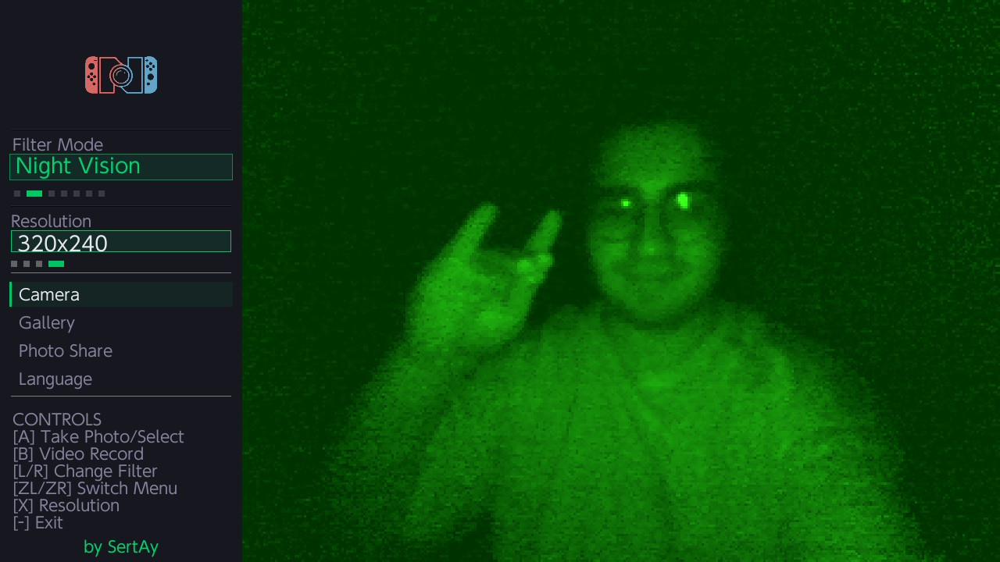
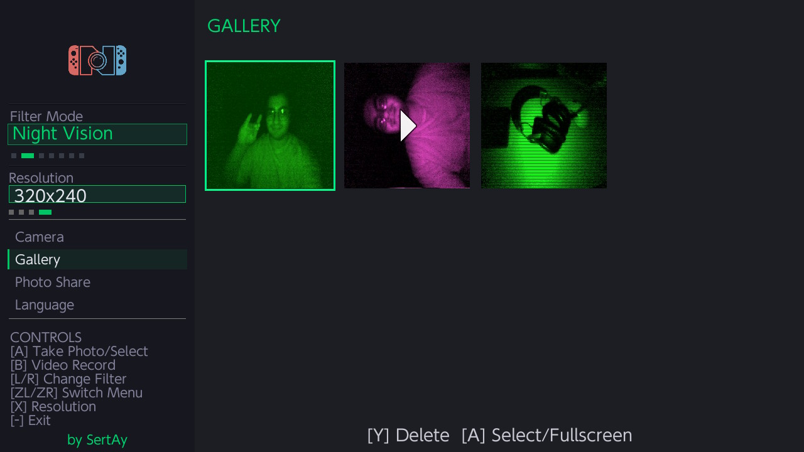
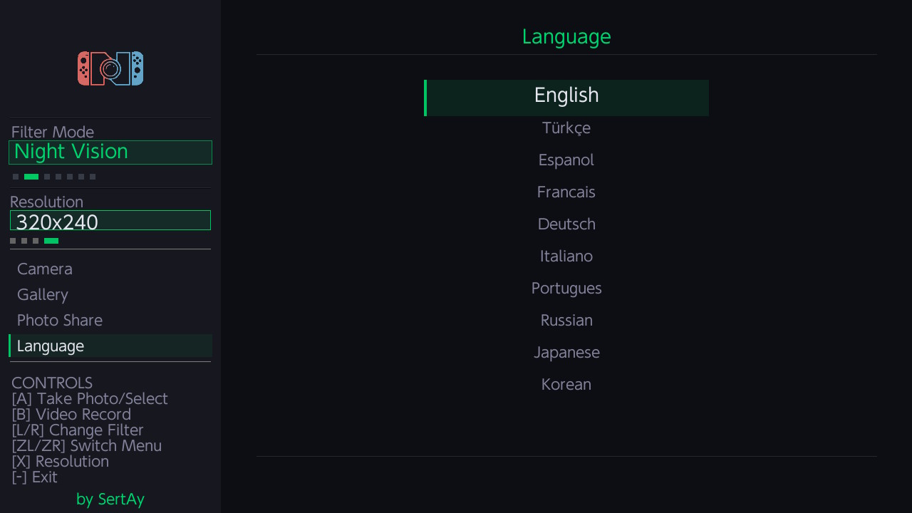

<h1 align="center">CamNX </h1>

  

[English](#english) | [Türkçe](#türkçe)

---

# English

CamNX is a powerful and easy-to-use homebrew camera application that allows you to take photos and record videos using the IR (Infrared) sensor located on the Right Joy-Con of your Nintendo Switch.

Record your surroundings from a different perspective with CamNX, adding a completely new feature to your console!

## 🌟 Features

- 📸 **Wide Capture Options:** Record both photos and videos for fun or practical purposes.
- 🎨 **Filter Support:** Add style to your photos with 6 different filters — Black & White, Night Vision, Thermal, Matrix, Barbie, Sepia.
- 🖥️ **Display Settings:** Adjustable resolution settings according to your needs.
- 🗂️ **Media Management:** Instantly review your captured photos and videos with the built-in gallery.
- 🕹️ **Wireless Freedom:** Completely wireless usage by detaching the Joy-Con from the console.
- 🌐 **Easy Sharing:** Easily access your files through a web browser from your phone or computer on the same Wi-Fi network.
- 🌍 **Language Support:** Full support for 10 different languages for worldwide usability.

## 🖼️ Screenshots

| Camera Interface | Gallery |
| :---: | :---: |
|  |  |

| Language Selection | Photo Share |
| :---: | :---: |
|  |  |

## 📥 Installation

**Method 1: Homebrew App Store (Automatic Installation)**
You can download and install the application directly on your Switch via the HB App Store.

  <a href="https://hb-app.store/switch/CamNX">
    
     
    <b>HB Store İndirme Linki</b>
  </a>

**Method 2: Manual Installation**
You can install the application by downloading it on your computer and transferring it to your SD card.

1. Download the latest `CamNX.nro` file from the [Releases](../../releases/latest) page.
2. Place the downloaded file into the `switch/` folder on your SD card. (Create the folder if it doesn't exist: `SD:/switch/CamNX/CamNX.nro`).
3. Open the Homebrew Menu (hbmenu) on your Switch and launch the CamNX application.

## 🎮 Usage Guide

1. After entering the application, point the IR sensor located at the bottom of the **Right Joy-Con** towards the object you want to shoot.
2. You can switch between filters and change the resolution using the on-screen button prompts.
3. To view photos in the gallery, press the Y button to go to the Menu, and then go to Gallery.
4. To transfer files to your computer or phone, go to the "Photo Share" tab from the menu. Type the IP address displayed on the screen (e.g., `192.168.1.5:8080`) into the browser of your device connected to the same network to access the files!

---

# Türkçe

CamNX, Nintendo Switch'inizin sağ Joy-Con'unda bulunan IR (Kızılötesi) sensörü kullanarak fotoğraf ve video çekmenizi sağlayan güçlü ve kullanımı kolay bir homebrew kamera uygulamasıdır. 

Konsolunuza tamamen yeni bir özellik kazandıran CamNX ile etrafınızı farklı bir gözden kaydedin!

## 🌟 Özellikler

- 📸 **Geniş Çekim Seçenekleri:** Eğlenceli veya pratik amaçlarla hem fotoğraf hem de video kaydı yapabiliyorsunuz.
- 🎨 **Filtre Desteği:** 6 farklı filtre — Siyah Beyaz, Gece Görüşü, Termal, Matrix, Barbie, Sepya ile fotoğraflarınıza tarz katın.
- 🖥️ **Görüntü Ayarları:** İhtiyacınıza göre çözünürlük ayarı mevcut.
- 🗂️ **Medya Yönetimi:** Dahili galeri ile çektiğiniz fotoğraf ve videoları anında inceleyebiliyorsunuz.
- 🕹️ **Özgür Kullanım:** Joy-Con'u konsoldan çıkartarak tamamen kablosuz bir şekilde kullanım imkânı.
- 🌐 **Kolay Paylaşım:** Aynı Wi-Fi ağındaki telefon veya bilgisayarınızdan tarayıcı üzerinden dosyalara kolayca erişebiliyorsunuz.
- 🌍 **Dil Desteği:** Dünya çapında kullanım için tam 10 farklı dil desteği.

## 🖼️ Ekran Görüntüleri

| Kamera Arayüzü | Galeri |
| :---: | :---: |
|  |  |

| Dil Seçimi | Fotoğraf Paylaşımı |
| :---: | :---: |
|  |  |

## 📥 Kurulum (Nasıl Yüklenir?)

**1. Yöntem: Homebrew App Store (Otomatik Kurulum)**
Uygulamayı doğrudan Switch üzerinden **HB App Store** aracılığıyla indirip kurabilirsiniz.

  <a href="https://hb-app.store/switch/CamNX">
    
     
    <b>HB Store İndirme Linki</b>
  </a>

**2. Yöntem: Manuel Kurulum**
Uygulamayı bilgisayarınız üzerinden indirip SD kartınıza atarak kurabilirsiniz.

1. [Releases](../../releases/latest) sayfasından en güncel `CamNX.nro` dosyasını indirin.
2. SD kartınızdaki `switch/` klasörünün içine bu dosyayı atın. (Eğer klasör yoksa oluşturun: `SD:/switch/CamNX/CamNX.nro`)
3. Switch üzerinden Homebrew Menu'ye (hbmenu) girip CamNX uygulamasını çalıştırın.

## 🎮 Kullanım Rehberi

1. Uygulamaya girdikten sonra **Sağ Joy-Con**'un alt kısmında bulunan IR sensörünü çekmek istediğiniz nesneye doğru tutun.
2. Ekranda gösterilen buton yönlendirmeleri ile filtreler arasında geçiş yapabilir ve çözünürlüğü değiştirebilirsiniz.
3. Galeride fotoğrafları incelemek için Y tuşuna basarak Menü'ye, oradan da Galeri'ye gidin.
4. Dosyaları bilgisayara veya telefona aktarmak için menüden "Fotoğraf Paylaşımı" sekmesine gelin. Ekranda çıkan IP adresini (örn: `192.168.1.5:8080`) aynı ağa bağlı cihazınızın tarayıcısına yazarak dosyalara ulaşın!

---

**Developer / Geliştirici:** SertAy
